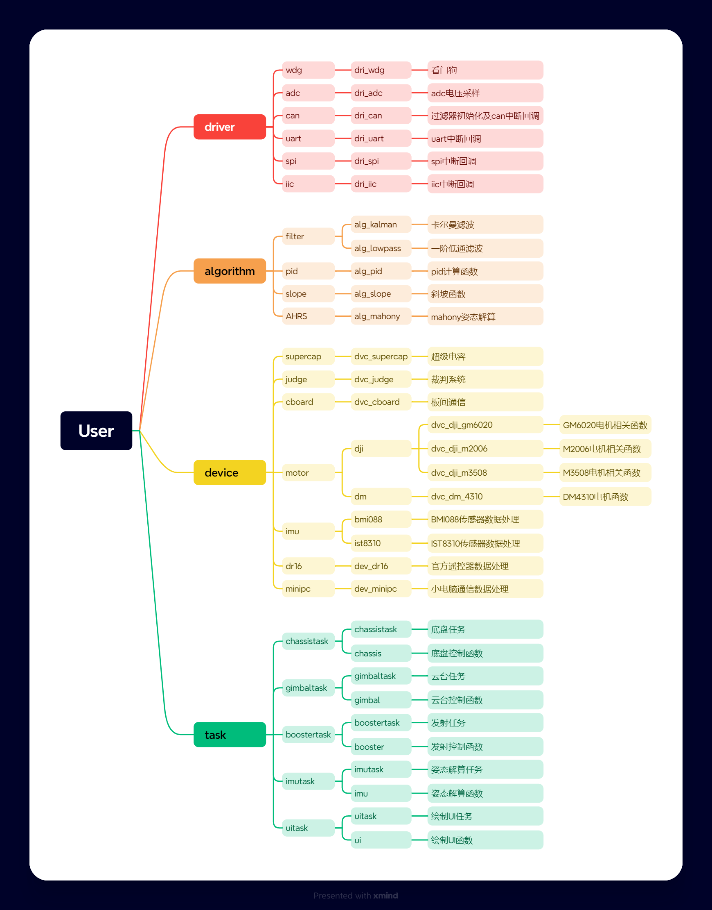
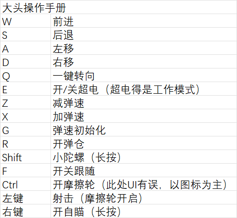

# 20241119_DaTou
## 项目介绍
PHOENIX25赛季上供弹式全向步兵机器人电控代码
## 开发指南
### 开发工具
1. [**CUBEMX**](https://www.st.com/en/development-tools/stm32cubemx.html)
>- 用途：ST官方推出的图形化配置工具，用于快速生成 STM32微控制器 的初始化代码和项目框架。  
>- 特点：通过可视化界面配置芯片引脚、时钟树、外设（如GPIO、UART、SPI、I2C等）和中间件（如FreeRTOS、USB库）。
支持生成基于 HAL库（硬件抽象层）或 LL库（底层库）的代码。
可生成兼容多种IDE（如Keil、IAR、Eclipse）的项目文件。
提供功耗估算、中间件集成等辅助功能。  
>- 适用场景：STM32项目的初始搭建，减少手动编写底层配置代码的时间。
2. [**KEIL5**](https://www.keil.com/download/product/)
>- 用途：ARM官方推荐的集成开发环境（IDE），主要用于 Cortex-M系列 微控制器的开发。  
>- 特点：包含编译器（ARM Compiler）、调试器、仿真器和µVision集成开发界面。
支持ARM汇编、C/C++开发，内置丰富的芯片支持包（Device Family Pack）。
提供实时操作系统（RTOS）调试、性能分析等高级功能。
商业软件，需购买授权（社区版有代码大小限制）。  
>- 适用场景：嵌入式固件开发，尤其是需要稳定调试环境和官方支持的场景。
3. [**Visual Studio Code**](https://code.visualstudio.com/)  (选用)
>- 用途：微软推出的轻量级代码编辑器，通过插件扩展可支持嵌入式开发。  
>- 特点：免费、跨平台（Windows/macOS/Linux），支持丰富的插件生态。
通过 C/C++扩展、PlatformIO插件 或 Eclipse Embedded CDT 支持嵌入式开发。
集成终端、Git版本控制、代码高亮、智能提示等功能。  
>- 适用场景：偏好灵活、轻量化开发环境的开发者，或需要跨平台协作的项目。
4. [**J-Scope**](https://www.segger.com/products/debug-probes/j-link/tools/j-scope/)
>- 用途：SEGGER推出的实时数据可视化工具，用于嵌入式系统的调试和数据分析。  
>- 特点：通过 J-Link调试器 实时读取微控制器内存中的变量数据，无需额外代码。
支持绘制波形图、柱状图、表格等多种数据展示形式。
低资源占用，适合实时监测关键变量（如传感器数据、状态标志）。
支持离线数据记录和导出。  
>- 适用场景：动态调试、算法验证、系统性能监控等需要实时可视化的场景。
5. [**VOFA+**](https://www.vofa.plus/)  (选用)
### 使用流程
1. 编译代码：
点击 Build（F7）按钮，确保无错误（0 Error, 0 Warning）。
2. 连接硬件：
用J-Link或CMISI-DAP调试器连接开发板和电脑。
3. 下载程序：
点击 Download（F8）按钮，将程序烧录到C板。
## 嵌入式架构
### 软件架构

### 硬件架构
+ 电源线
    + Chassis <u>四个底盘电机（M3508*4），超电</u>
    + Gimbal <u>两个云台电机（Yaw：GM6020，Pitch：Gm6020）</u>
    + MiniPC <u>小电脑和C板供电</u>
    + Ammo-Booster <u>射击机构供电（摩擦轮：M3508*2，拨弹盘：M2006），荧光充能</u>
+ CAN线
    + CAN1 <u>底盘四电机，超电，Yaw轴电机</u>
    + CAN2 <u>Pitch轴电机，摩擦轮电机，拨弹盘电机</u>
+ Uart通信
    + uart3 <u>接收遥控器数据串口</u>
    + uart1 <u>VOFA+调试串口</u>
    + uart6 <u>裁判系统通信串口</u>
+ 裁判系统线材 <u>详见裁判系统手册</u>
    + 航空线
    + GH线材
## 键鼠操作指南

## 未来优化方向
- [ ] 尝试新的限功率模型
- [x] 斜坡函数步长调整
- [ ] 接线优化
- [ ] 加PI环提升云台响应速度
- [X] 能在斜坡上抱死电机
- [ ] 弹频不稳定修改
- [ ] 加前馈补偿
- [ ] 全自动发射
- [ ] 代码整理
## 许可证  
本项目采用 GNU 通用公共许可证 第 2 版 (GPL v2.0) 授权。  
详细内容请参阅 [LICENSE](LICENSE) 文件。  